# android-basics

Android basics for app development

# App Screens

## Login Page
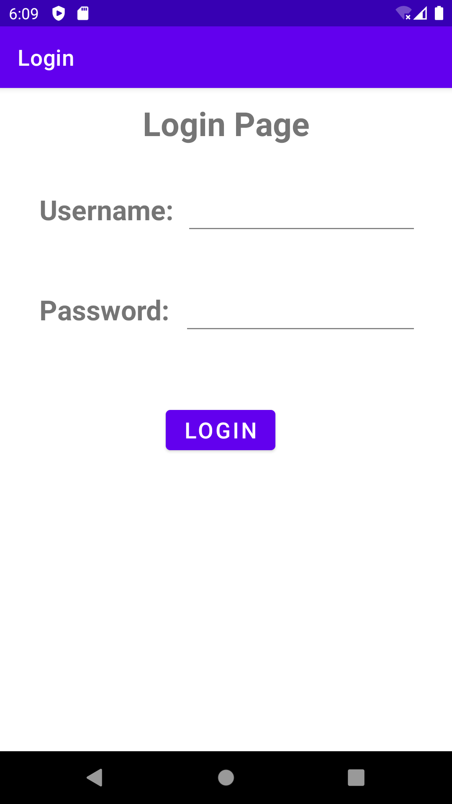 

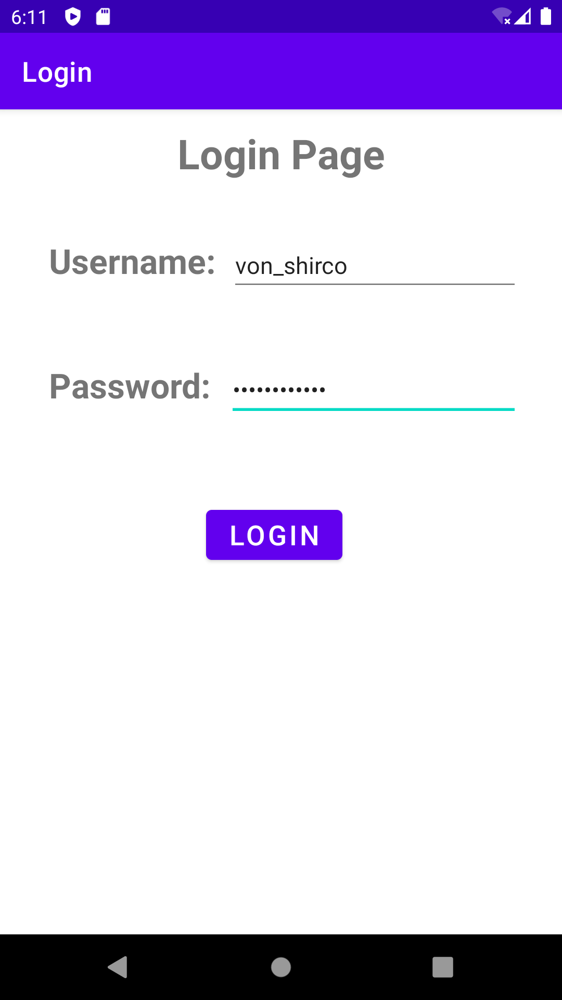

## Compose Email Page
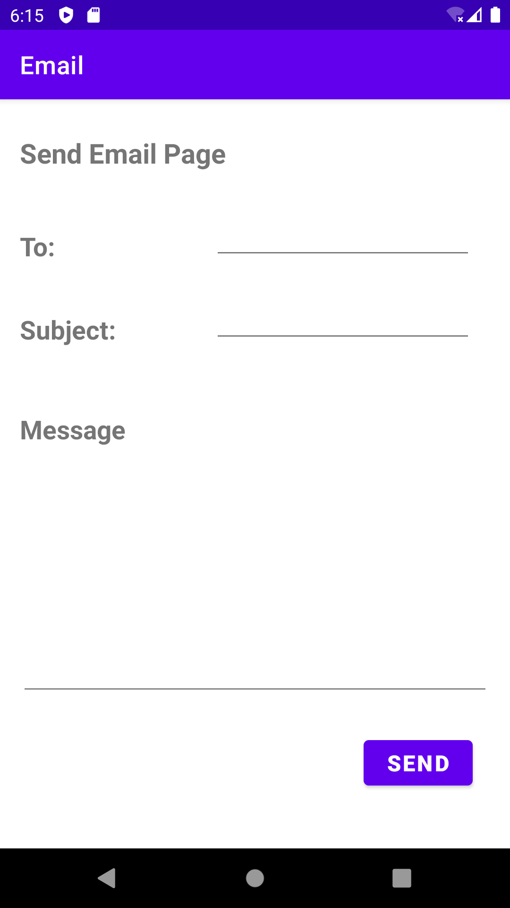 

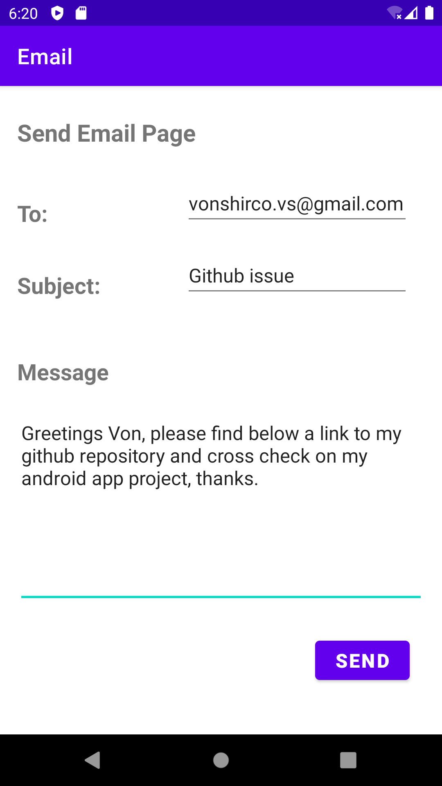

## Two Activities
### Main Activity
 

### Second Activity

## Intents Passing Data
### Page 1
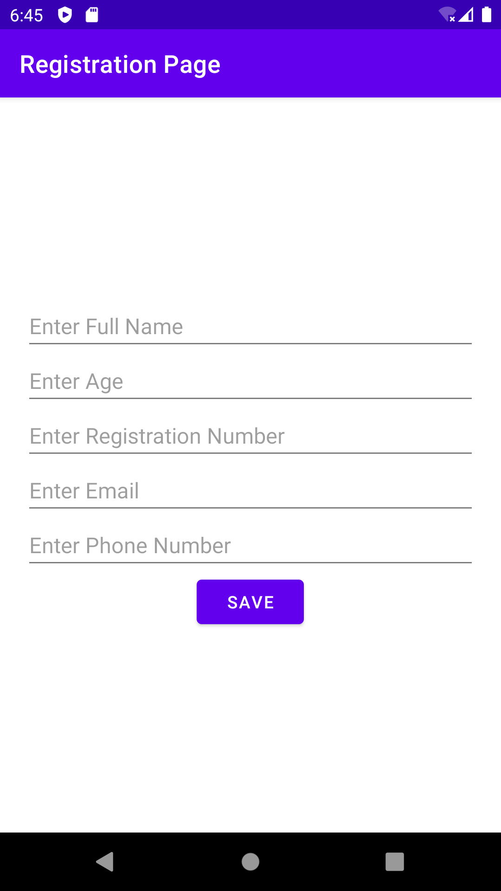 

### Page 2
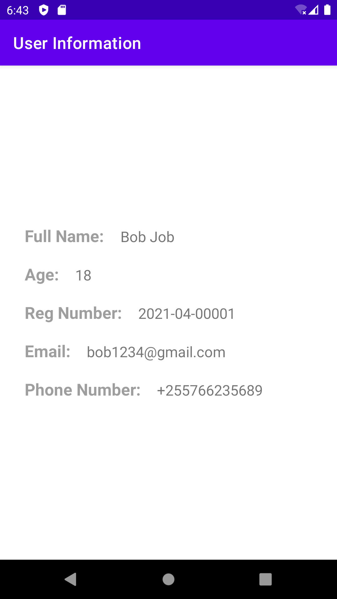

## Simple Calculator
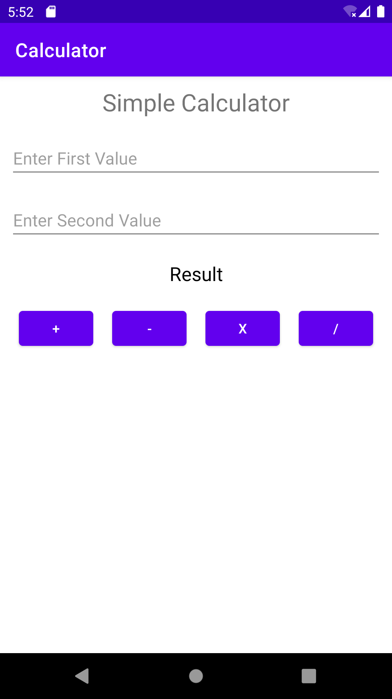 

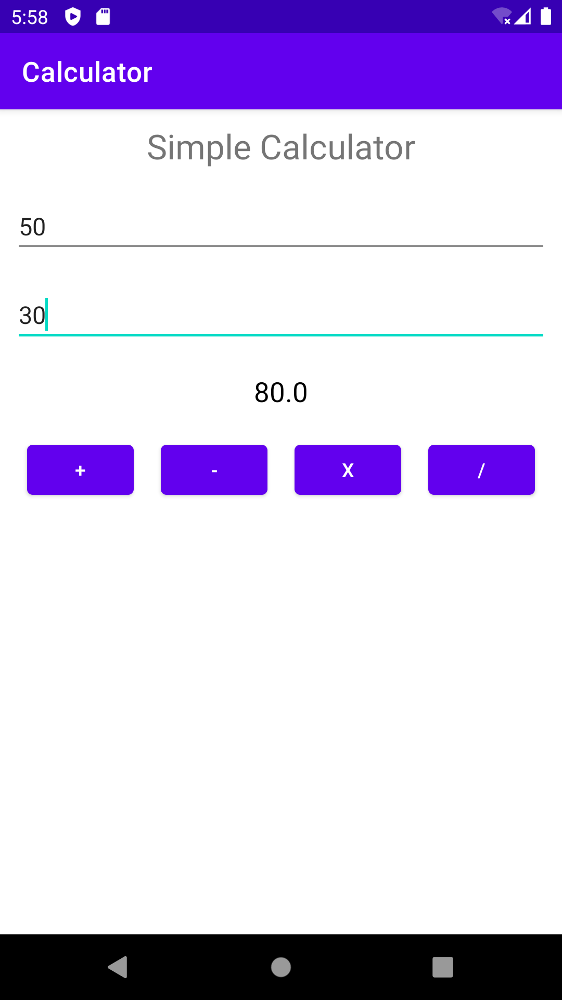

## UI Fragments
### Home Fragment
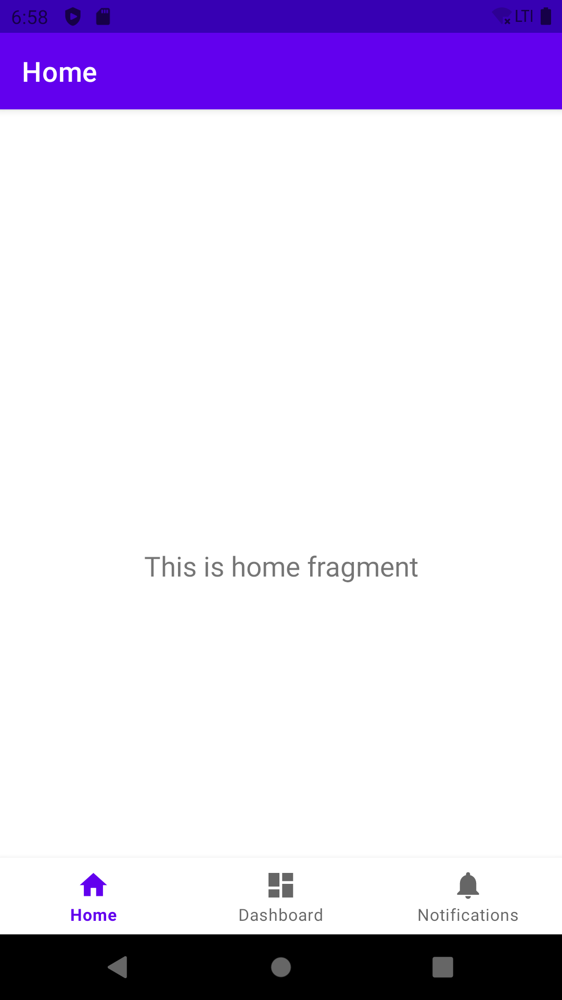 

### Dashboard Fragment
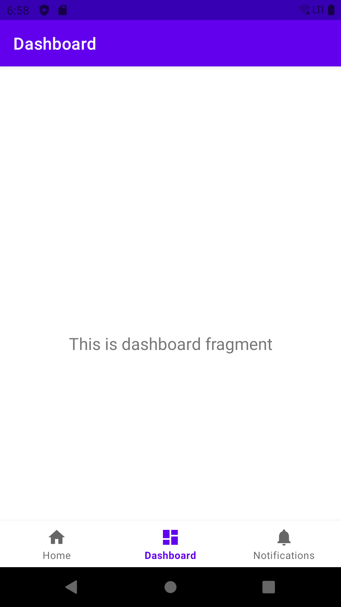

### Notifications Fragment
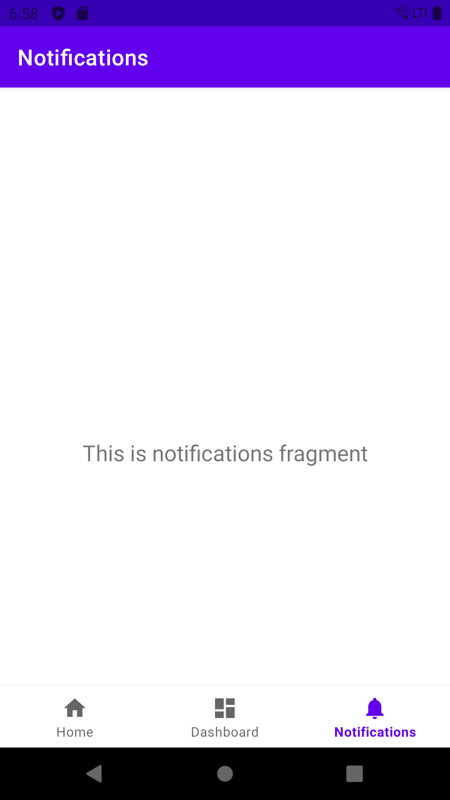
